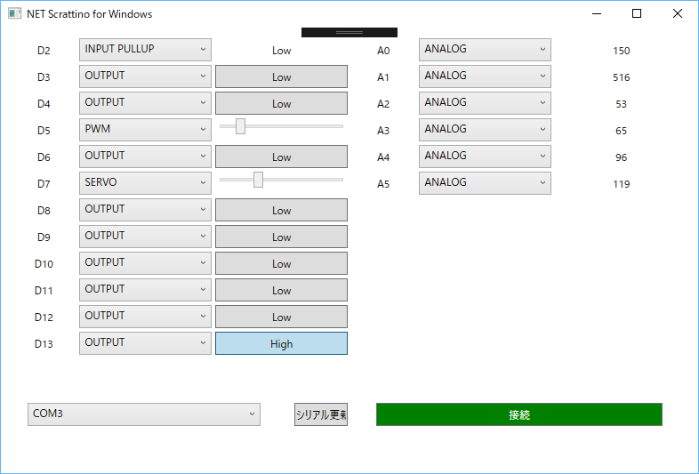
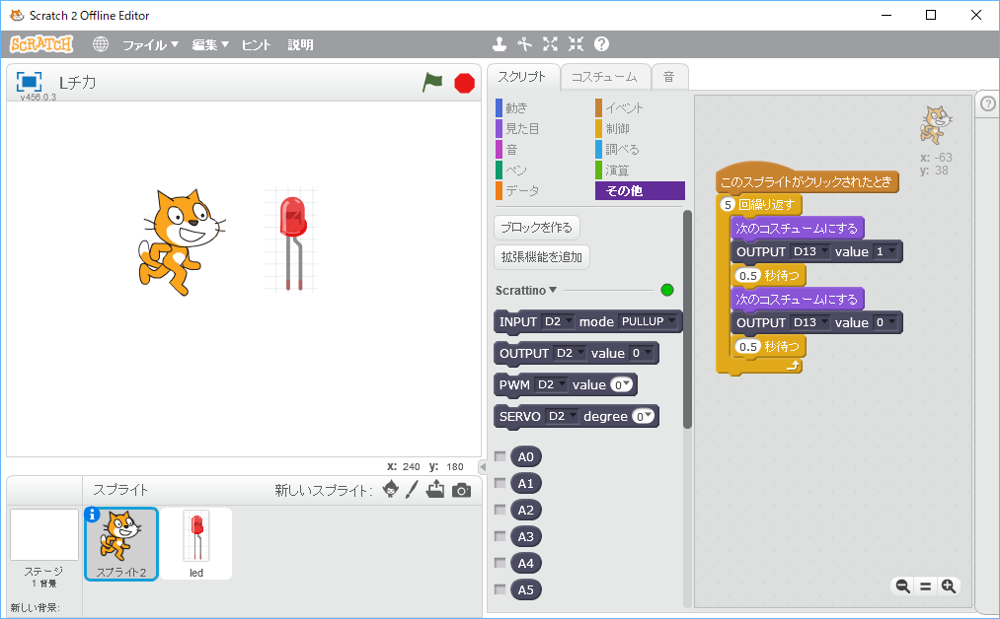
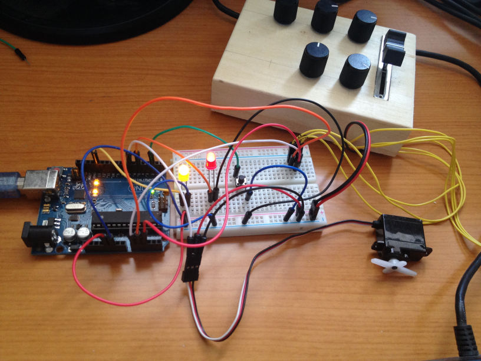

# NetScrattino

NetScrattino is Simple Server to connect to Arduino(Firmata) by Scratch v2.0. You can easily access to Arduino from Offline Scratch 2.0 by using Extention Blocks.

NetScrattino is clone that [Scrattino 2 | Yengawa Systems](http://www.yengawa.com/scrattino2) made by .NET on Windows. Special Thanks to Yengawa-san.

Scratch から Arduino(Firmata) に接続するための簡易サーバーです。

[Scrattino 2 | Yengawa Systems](http://www.yengawa.com/scrattino2) の Windows 版クローンになります。

# 解説

主な設定は [スクラッチーノでScratchとArduinoをつなぐ](https://sites.google.com/site/meidedigitalcraft2016/knowhow/scrattino-usage) と同じです。

拡張ブロックの読み込みで、Scratch/Extensions/scrattino2net.json を読み込ませください。

USBケーブルで接続しているArduinoのCOMを指定して「接続」してください。

# サンプル

Scratch/Samples 内にいくつかのサンプルがあります。

# License

The MIT License (MIT)

# Author

Tomoaki Masuda

